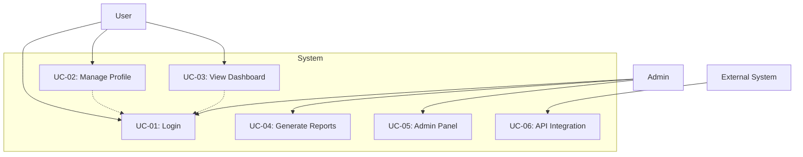
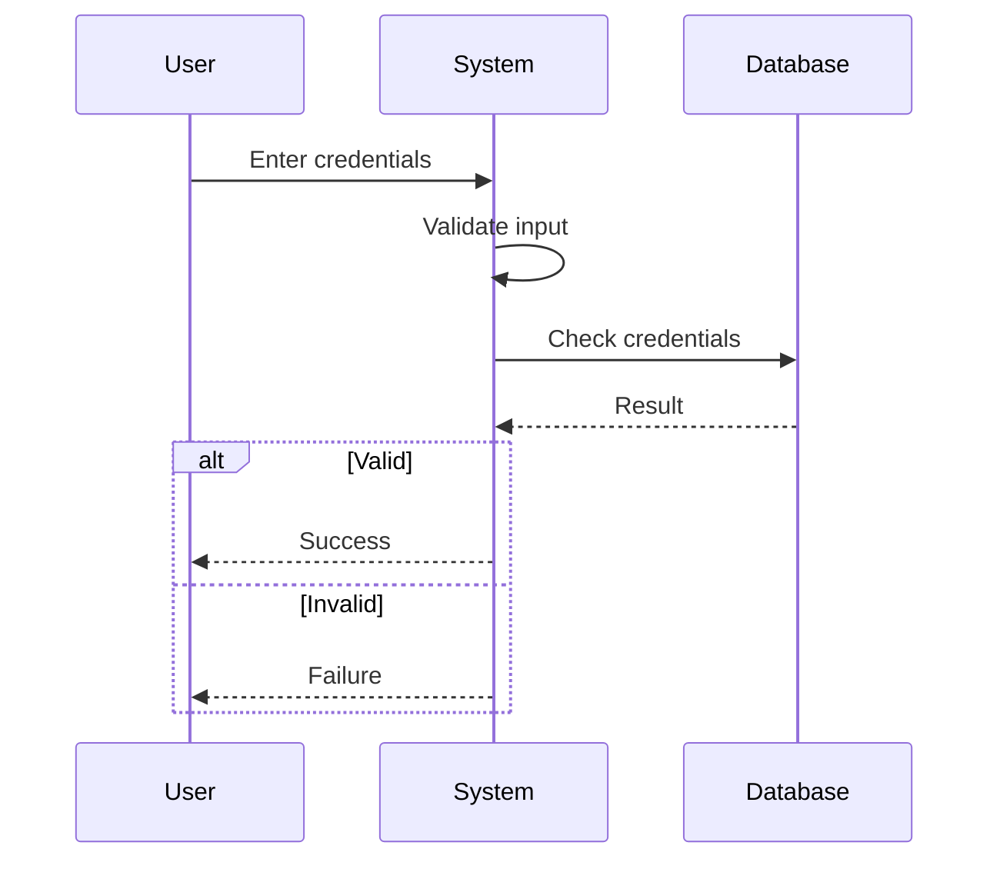

## Purpose
Template optimized for AI agents to implement features with sufficient context and self-validation capabilities to achieve working code through iterative refinement.

## Core Principles
1. **Context is King**: Include ALL necessary documentation, examples, and caveats
2. **Validation Loops**: Provide executable tests/lints the AI can run and fix
3. **Information Dense**: Use keywords and patterns from the codebase
4. **Progressive Success**: Start simple, validate, then enhance
5. **Global rules**: Be sure to follow all rules in CLAUDE.md

## Best Practices
1. **Be Specific**: Use measurable criteria and concrete examples
2. **Be Testable**: Each requirement should be verifiable
3. **Be Traceable**: Use unique IDs for requirement tracking
4. **Be Complete**: Avoid ambiguous language and undefined terms
5. **Mark Unclear**: Flag requirements needing clarification rather than guessing
---

## Goal
[What needs to be built - be specific about the end state and desires against the current state]

## Why
- [Business value and user impact]
- [Integration with existing features]
- [Problems this solves and for whom]

## What
[User-visible behavior and technical requirements]

### Success Criteria
- [ ] [Specific measurable outcomes]

## Tech Stack
- [Layer]: [Technology list]

Note: Include the research based technology stack

## Functional Requirements
- FR-001: System MUST [specific capability]
- FR-002: System MUST [specific feature]
- FR-003: System MUST [business rule]
- FR-004: [UNCLEAR] System MUST [ambiguous functional requirement needing clarification]

**Note**: Mark unclear or ambiguous requirements with [UNCLEAR] tag for later clarification.

## Non-Functional Requirements
- NFR-001: System MUST [performance requirement]
- NFR-002: System MUST [security requirement]
- NFR-003: System MUST [availability requirement]
- NFR-004: System MUST [scalability requirement]
- NFR-005: [UNCLEAR] System MUST [ambiguous non-functional requirement needing specification]

**Note**: Mark unclear or ambiguous requirements with [UNCLEAR] tag for later clarification.

## Technical Requirements
- TR-001: System MUST [technology choice]
- TR-002: System MUST [architecture requirement]
- TR-003: System MUST [platform requirement]
- TR-004: System MUST [integration requirement]
- TR-005: [UNCLEAR] System MUST [ambiguous technical requirement needing specification]

**Note**: Mark unclear or ambiguous requirements with [UNCLEAR] tag for later clarification.

## Data Requirements
- DR-001: System MUST [data structure]
- DR-002: System MUST [data integrity]
- DR-003: System MUST [data retention]
- DR-004: System MUST [data backup]
- DR-005: System MUST [data migration]
- DR-006: [UNCLEAR] System MUST [ambiguous data requirement needing specification]

**Note**: Mark unclear or ambiguous requirements with [UNCLEAR] tag for later clarification.

## UX Requirements
- UXR-001: System MUST [usability requirement]
- UXR-002: System MUST [accessibility requirement]
- UXR-003: System MUST [responsiveness requirement]
- UXR-004: System MUST [visual design requirement]
- UXR-005: System MUST [interaction requirement]
- UXR-006: System MUST [error handling requirement]
- UXR-007: [UNCLEAR] System MUST [ambiguous UX requirement needing specification]

**Note**: Mark unclear or ambiguous requirements with [UNCLEAR] tag for later clarification.

## Use Case Analysis

### Actors & System Boundary
- [Primary Actor]: [Role description and responsibilities]
- [Secondary Actor]: [Supporting role and interaction type]
- [System Actor]: [External systems that interact with our system]

### Use Case Diagrams (Mermaid)

#### System Overview Use Case Diagram

#### Sequence Diagram Example

### Use Case Specifications
#### UC-[ID]: [Use Case Name]
- **Actor**: [Primary Actor]
- **Goal**: [Goal]
- **Preconditions**: [State before]
- **Success Scenario**:
  1. [Step 1]
  2. [Step 2]
  3. [Step 3]
- **Extensions**:
  - 2a. [Alternative]
  - 3a. [Exception]
- **Postconditions**: [State after]

## Core Entities
- [Entity 1]: [Description]
- [Entity 2]: [Description]

## Epics
| Epic ID | Epic Title | Mapped Requirement IDs |
|---------|------------|------------------------|
| EP-001 | User Account Access & Authentication | FR-001, FR-002, FR-003, NFR-002, TR-004, UXR-001 |
| EP-002 | Performance & Reliability Foundation | NFR-001, NFR-003, NFR-004, TR-003, DR-004 |
| EP-003 | Core Data & Persistence Layer | TR-001, DR-001, DR-002, DR-003, DR-005 |
| EP-004 | API & Integration Enablement | TR-002, TR-004, FR-002, DR-005 |
| EP-005 | User Experience & Accessibility | UXR-001, UXR-002, UXR-003, UXR-004, UXR-005, UXR-006 |
| EP-006 | Reporting & Administrative Operations | FR-004 (pending), UC-04 (reports), UC-05 (admin panel), NFR-002 |
| EP-007 | Security & Compliance Controls | NFR-002, NFR-003, DR-003, DR-004 |

## Risks & Mitigations
- [Top risks here]

## Constraints & Assumptions
- [Constraints/assumptions here]

## Areas for Potential Improvement
- [Actionable improvement suggestions]
